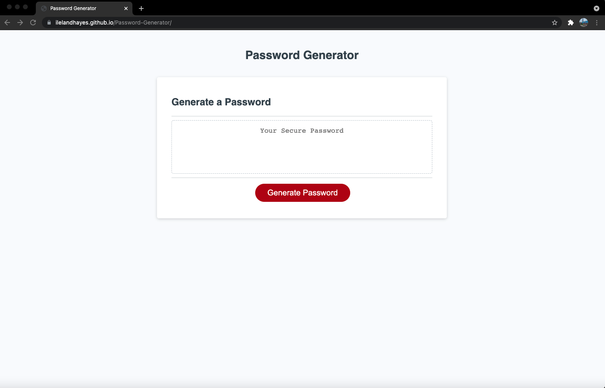

# Password-Generator

# Description
 
    * A password generator for company employees that is soly based upon criteria they have chosen for their specific password.
    * Using complex HTML, CSS, and Java Script

# Describing Code

    * Created prompts for user criteria on password when button is pressed
        *which is ran through an alert box
    * Which is character length, specail characters, uppercase and lowercase letter
    * When all criteria's are chosen then the password result is displayed in the textbox

# Screenshot 

